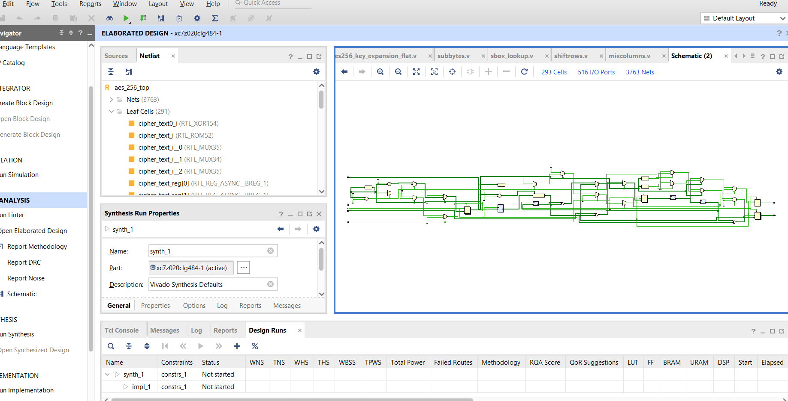

# AES-256-bit-Key-Encryption--Vivado-Architecture
RTL architecture design of an AES-256 encryption core in Xilinx Vivado, verified up to structural logic and RTL schematic generation.

# AES-256 Hardware Architecture Design

## Project Overview
This project is an RTL-level hardware implementation of the AES-256 encryption standard designed using Xilinx Vivado. The primary objective was mapping the structural logic of the algorithm and analyzing data-path synthesis.

## Status: Synthesized RTL Architecture
* **Completed:** RTL design entry, compilation, and RTL Schematic/Diagram generation.
* **Current Boundary:** Hardware Pin Limitation Study (Detailed below).

## Tools Used
* **IDE:** Xilinx Vivado
* **Language:** Verilog

## Module Hierarchy
| Module | File | Description |
|---|---|---|
| `aes_256_top` | `aes_256_top.v` | Top-level FSM — 14-round encryption controller |
| `aes256_key_expansion_flat` | `aes256_key_expansion_flat.v` | Combinational key expander — generates 15 round keys from 256-bit key |
| `subbytes` | `subbytes.v` | SubBytes stage — 16 parallel S-box substitutions |
| `sbox_lookup` | `sbox_lookup.v` | AES S-box (256-entry lookup table) |
| `shiftrows` | `shiftrows.v` | ShiftRows stage — byte permutation across state rows |
| `mixcolumns` | `mixcolumns.v` | MixColumns stage — GF(2^8) column mixing |

## Bug Fixes (v2)

### 1. Pulse-triggered FSM (Critical)
**Before:** The `start` signal had to be held HIGH for all 15 clock cycles. Releasing it early stalled the FSM mid-encryption with no recovery path except a full reset.

**After:** `start` is now a single-cycle trigger. Pulse it once and the FSM runs autonomously through all 15 rounds. The `round > 0` branch handles progression without checking `start`.

### 2. `done` auto-clear (Critical)
**Before:** `done` was set to 1 at round 14 and only cleared on `rst`. It stayed HIGH indefinitely after encryption, misleading downstream logic into thinking a new encryption was already complete.

**After:** An `else` branch clears `done` to 0 on the idle cycle after completion. `done` now pulses HIGH for exactly one clock cycle.

### 3. Stale `cipher_text` output
**Before:** `cipher_text` retained the previous encryption's result between encryptions. Downstream logic could read old ciphertext as valid output.

**After:** `cipher_text` is cleared to 0 at the start of each new encryption (when `start` is pulsed).

### 4. Key expansion port mismatch (Warning)
**Before:** `aes256_key_expansion_flat` declared `clk`, `rst`, `start` as inputs but never used them (purely combinational `always @(*)`). Top module connected `clk`/`rst` and commented out `start`, causing Vivado port mismatch warnings.

**After:** Removed all three unused ports. The module now cleanly declares only `key_in` and `round_keys_flat`.

### 5. `state` register not reset
**Before:** `state` was the only register missing from the `rst` block. On power-up or reset, it held an unknown `X` value, causing SubBytes/ShiftRows/MixColumns to operate on garbage data.

**After:** `state <= 0` added to the reset condition. All registers start at a known value.

## Architectural Case Study: The I/O Pin Bottleneck
During the initial synthesis phase, the design encountered an **I/O Placement Overutilization Error**. 

### The Problem:
A fully parallelized AES-256 core requires:
* 256 bits for the Key input
* 128 bits for the Plaintext input
* 128 bits for the Ciphertext output
* Additional control signals (`clk`, `rst`, `ready`, etc.)

This results in a top-level module requiring **515+ physical I/O pins**. When compiled without a specific pin-reduction strategy, Vivado identifies that the design exceeds the available physical package boundaries of standard target FPGAs.

### Next Steps & Key Takeaways:
Because this project stopped at the RTL schematic layer due to physical routing limitations, the core architectural lesson is being actively applied to our next project: a **BB84 QKD Implementation on a Zynq ZedBoard**. 

To resolve the 500+ pin bottleneck, the architecture will transition from direct parallel I/O ports to a **Hardware-Software Co-Design** approach, using an internal **AXI4-Lite/Stream interface** to stream data through the Zynq Processing System (PS) instead of physical FPGA pins.

## Synthesized RTL Schematic

